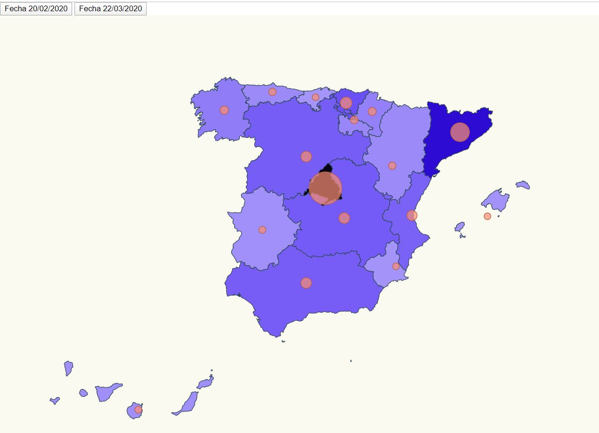

# Advanced-Visualization

Infected cases in Spain and change color for most cases.



# Steps

# Install

- Execute npm install. 

```bash
npm install
```

# Start

- We start for visualization map.

```bash
npm start

# Data Source

- https://interaktiv.morgenpost.de/corona-virus-karte-infektionen-deutschland-weltweit/
